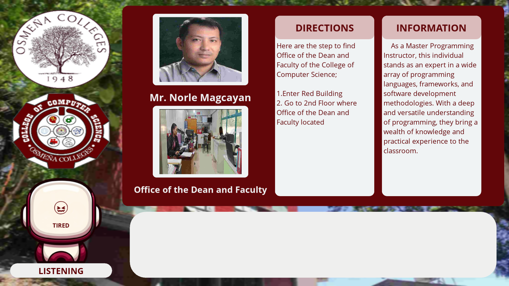

# RoomFinder 🎤📍

## Short Introduction

RoomFinder is a **desktop application powered by machine learning and voice interaction** that assists users in locating instructors and rooms within a specific building or campus area.

The system works **entirely offline**, meaning it does not require an internet connection to function. Users simply **speak their queries**, and the application processes the request using speech recognition and machine learning to determine the requested location. The result is then communicated through **text-to-speech** while also displaying the location visually within the application.

This project demonstrates the integration of **voice interaction, machine learning, and graphical user interfaces** to create a practical navigation tool.

---

## Technologies Used

### Programming Language

* Python

### Frameworks

* Kivy
* KivyMD

### Libraries

* Scikit-Learn
* PyAudio
* Speech Recognition
* Text-to-Speech

### Concepts Used

* Machine Learning Classification
* Voice Command Processing
* Offline Application Development
* GUI Development

---

## Process on How I Built It

1. **Identified the Problem**
   Users often struggle to find rooms or instructors in large buildings. The goal was to create a simple tool that can answer location queries.

2. **Designed the Voice Interaction System**
   Implemented speech input so users could interact with the system through natural voice commands.

3. **Integrated Machine Learning**
   Used **Scikit-Learn** to build a model that processes and interprets user queries.

4. **Implemented Audio Processing**
   Used **PyAudio** to capture microphone input and process the voice commands.

5. **Added Text-to-Speech Response**
   After identifying the requested location, the system responds with an audible answer using text-to-speech.

6. **Developed the User Interface**
   Built the graphical interface using **Kivy and KivyMD** to display location results visually.

7. **Ensured Offline Functionality**
   Designed the system so all processing occurs locally on the machine.

---

## What I Learned

Through this project, I learned:

* How to integrate **machine learning into a functional application**
* How to implement **voice-based user interfaces**
* Handling **audio input and processing in Python**
* Developing **cross-platform graphical interfaces with Kivy**
* Designing **offline AI-powered applications**

---

## Overall Growth

This project helped improve my ability to:

* Design and implement **end-to-end software projects**
* Combine **machine learning with user interface development**
* Debug complex systems involving **audio processing and ML models**
* Translate a real-world problem into a **practical software solution**

It also strengthened my understanding of building **interactive and intelligent applications**.

---

## How It Can Be Improved

Future improvements for this project may include:

* Implementing **Natural Language Processing (NLP)** for better query understanding
* Adding **visual indoor maps** for navigation
* Supporting **multiple languages**
* Improving **speech recognition accuracy**
* Expanding the system to support **larger building databases**
* Deploying the application to **Android devices using Kivy**

---

## Running the Project

### 1. Clone the Repository

```bash
git clone https://github.com/astigPree/GuestOCAI.git
cd GuestOCAI
```

### 2. Install Dependencies
```bash
pip install kivy kivymd scikit-learn pyaudio speechrecognition pyttsx3
```

### 3. Run the Application

```bash
python main.py
```

## Images 

 
 
